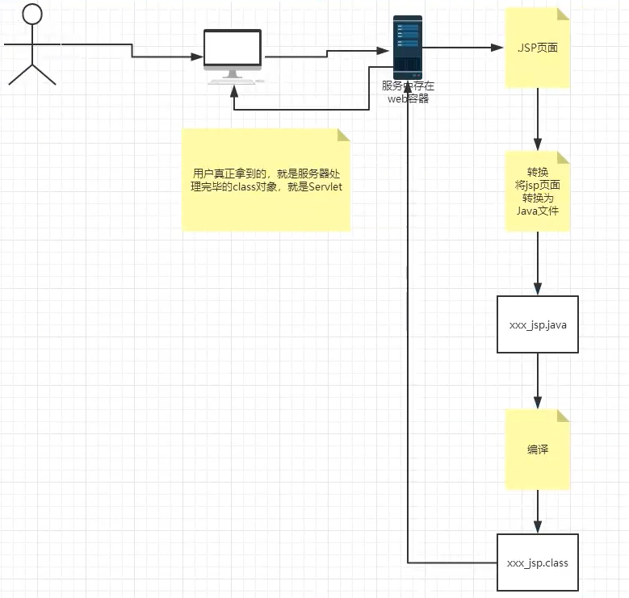

# JavaWeb

Java Web

## 1. 基本概念

### 1.1 前言

web开发：

- web，网页的意思（能够从网页拿到一定资源）
- 静态web
  - html，css， （模板引擎）
  - 提供给所有人看的数据始终不会发生变化！
- 动态web
  - 不同人，不同情况，看的数据会发生变化-
  - 淘宝、几乎所有的网站
  - 技术栈：Servlet/JSP, ASP, PHP


在Java中，动态Web资源开发的技术统称为JavaWeb；

### 1.2 web应用程序

什么是程序：按照一定步骤执行达到目的

web应用程序：可以提供浏览器访问的程序；

- a.html、b.html......多个web资源，这些资源可以被外界访问，对外界提供服务；
- 你们能访问到的任何一个页面或者资源，都存在与这个世界的某一个角落的计算机中
- URL：统一资源定位标志
- 这个统一的web资源会被放在同一个文件夹下，web应用程序-->Tomcat：服务器
- 一个web应用由多部分组成（静态web，动态web）
  - html，css， js
  - jsp， servlet【这个阶段要学的东西】
  - java程序
  - jar包
  - 配置文件（Properties）

web应用程序编写完毕之后，要想提供给外界访问：需要一个服务器来统一管理；

### 1.3 静态web

- *.htm, *.html 这些都是网页的后缀，如果服务器上一直存在这些东西，我们就可以直接进行读取、联络；
- 


- 静态Web的缺点：
  - Web页面无法动态更新，所有用户看到的都是同一个界面
    - 轮播图，点击特效：伪动态
    - JavaScript【实际开发中，他用的最多】
    - VBScript
  - 他无法和数据库交互（数据无法持久化，用户无法交互）

### 1.4 动态Web

页面会动态展示：“Web的页面展示的效果因人而异”；


缺点：

- 假如服务器的动态web资源出现了错误，我们需要重新编写我们的**后台程序**，重新发布；
  - 停机维护

优点：（静态的不说优点是因为没啥优点）

- Web页面可以动态更新，所有用户看到的不是同一个界面
  - 轮播图，点击特效：伪动态
  - JavaScript【实际开发中，他用的最多】
  - VB
- 他可以和数据库交互（数据持久化:注册，用户信息）

新手村--> 魔鬼训练（**分析原理，看源码**）-->PK场

## 2. Web服务器

### 2.1 技术讲解

ASP

- 微软的：国内最早流行的就是ASP；

- 在HTML中嵌入了VB的脚本，ASP + COM；

- 在ASP开发中，基本一个页面都有几千行的业务代码，页面极其混乱

- 维护成本高，重构成本高

- 语言用的C#

- 服务器IIS

  ```html
  <h1>
      <h1>
          <h1>
              <%
                 sout
                 %>
                  <h1>
                      
  ```

  

php

- PHP开发速度很快，功能很强大，跨平台，代码很简单（中国70%的网站都是中小型，WP）
- 无法承载大访问量的情况；（局限性）


JSP/Servlet：

- sun公司主推B/S架构
- 基于Java语言（所有的大公司或者一些开源的组件都是用Java写的）
- 可以承载三高问题带来的影响：高并发，高可用，高性能
- 语法想ASP，方便ASP的转JSP，加强市场强度


、、、、、、（还有很多）

### 2.2 web服务器

服务器是一种被动的操作，用来处理用户的一些请求和给用户一些响应信息。


**IIS**

微软的，用来跑ASP... Windows自带

**Tomcat**

面向百度编程

Tomcat是Apache 软件基金会（Apache Software Foundation）的Jakarta 项目中的一个核心项目，由[Apache](https://baike.baidu.com/item/Apache/6265)、Sun 和其他一些公司及个人共同开发而成。由于有了Sun 的参与和支持，最新的Servlet 和JSP 规范总是能在Tomcat 中得到体现，Tomcat 5支持最新的Servlet 2.4 和JSP 2.0 规范。因为Tomcat 技术先进、性能稳定，而且**免费**，因而深受Java 爱好者的喜爱并得到了部分软件开发商的认可，成为目前比较流行的Web 应用服务器。

Tomcat 服务器是一个免费的开放源代码的Web 应用服务器，属于轻量级应用[服务器](https://baike.baidu.com/item/服务器)，在中小型系统和并发访问用户不是很多的场合下被普遍使用，是开发和调试JSP 程序的首选。对于一个Java Web初学者来说，它是最佳的选择。

诀窍是，当配置正确时，Apache 为HTML页面服务，而Tomcat 实际上运行JSP 页面和Servlet。另外，Tomcat和[IIS](https://baike.baidu.com/item/IIS)等Web服务器一样，具有处理HTML页面的功能，另外它还是一个Servlet和JSP容器，独立的Servlet容器是Tomcat的默认模式。不过，Tomcat处理静态[HTML](https://baike.baidu.com/item/HTML)的能力不如Apache服务器。目前Tomcat最新版本为**9.0**。


**工作3-5年之后，可以尝试手写Tomcat服务器；**

下载Tomcat：

- 安装 or 解压
- 了解配置文件及目录结构
- 这个东西的作用


## 3. Tomcat

### 3.1 Tomcat下载

https://tomcat.apache.org/download-90.cgi

### 3.2 Tomcat启动和配置

文件夹的作用

startup.bat

shutdown.bat

可能遇到的问题：

1. Java环境变量没有配置
2. 闪退问题：需要配置兼容性
3. 乱码问题：配置文件中的设置

访问测试：http://localhost:8080/


服务器核心配置文件

server.xml

可以配置启动的端口号

- Tomcat的默认端口号为：8080

- mysql：3306

- HTTP：80

- HTTPS：443

```xml
<Connector port="8080" protocol="HTTP/1.1"
       connectionTimeout="20000"
       redirectPort="8443" />
```


可以配置主机的名称

- 默认的主机名为：localhost->27.0.0.1
- 默认网站应用存放的位置：webapps

```xml
<Host name="localhost"  appBase="webapps"
    unpackWARs="true" autoDeploy="true">
```


**高难度面试题：**

请你谈谈网站是如何进行访问的！

1. 输入一个域名，回车

2. 检查本机的hosts配置文件下有没有这个域名映射

   - 有：直接返回对应的ip地址，这个地址中有我们需要访问的web程序，所以可以直接访问

   - 没有：去DNS服务器找，找到的话就返回，找不到就返回找不到

     

3. 可以配置一些环境变量（可选）

### 3.3 发布一个网站

不会就先模仿

- 将自己写的网站，放到服务器（Tomcat）中指定的web应用文件夹（webapps）下，就可以访问了

网站应该有的结构：

```java
	--webapps：Tomcat服务器的web目录
		-ROOT
		-lihestudy：网站的目录名
				-WEB-INF
						-class：java程序
						-lib：web应用依赖的jar包
						-web.xml 网站的配置文件
				-index.html
				-static
    				-css
    					-style.css
    				-js
    				-img
    			-...
```


## 4. HTTP

### 4.1 什么是HTTP

http（超文本传输协议）是一个简单的请求-响应协议，它通常运行在TCP之上。

- 文本：html，字符串，~~~
- 超文本：图片，音乐，视频，定位，地图~~~
- 80端口

HTTPS：s（安全的）

- 443

### 4.2 两个时代

- HTTP 1.0
  - HTTP/1.0：客户端可以和web服务器连接后，只能获得一个web资源，断开连接
- HTTP 2.0
  - HTTP/1.1：客户端可以和web服务器连接后，可以获得多个web资源，断开连接


### 4.3 HTTP请求

- 客户端---发请求(Request)---服务器

百度：

```java
Request URL: https://www.baidu.com/  请求地址
Request Method: GET					get post 方法
Status Code: 200 OK					状态码：200
Remote Address: 14.215.177.39:443	
Referrer Policy: no-referrer-when-downgrade
    
```

```java
Accept: text/html,application/xhtml+xml
Accept-Encoding: gzip, deflate, br
Accept-Language: zh-CN,zh;q=0.9			语言
Cache-Control: max-age=0
Connection: keep-alive
```

1. **请求行**

   - 请求行中的请求方式：GET
   - 请求方式：GET/POST， HEAD， DELETE，PUT， TRACT~~~
     - get：一次请求能够携带的参数比较少，大小有限制，会在浏览器的URL地址栏显示数据内容，不安全，但高效
     - post:一次请求能够携带的参数比较多，大小没有限制，不会在浏览器的URL地址栏显示数据内容，安全，但不高效

2. **消息头**

   ```java
   Accept: 告诉浏览器，它支持的数据类型
   Accept-Encoding: 支持哪种编码格式  GBK UTF-8 GB2312 ISO8859-1
   Accept-Language: 告诉浏览器，它的语言环境
   Cache-Control: 缓存控制
   Connection: 告诉浏览器，请求完成是断开还是保持连接
   Host：主机 ~~~~~
   ```

   


### 4.4 HTTP响应

- 服务器---响应---客户端

```java
Cache-Control: private   // 缓存控制
Connection: keep-alive	//连接
Content-Encoding: gzip		编码类型
Content-Type: text/html;	
```

1. **响应体**

   ```java
   Accept: 告诉浏览器，它支持的数据类型
   Accept-Encoding: 支持哪种编码格式  GBK UTF-8 GB2312 ISO8859-1
   Accept-Language: 告诉浏览器，它的语言环境
   Cache-Control: 缓存控制
   Connection: 告诉浏览器，请求完成是断开还是保持连接
   Host：主机 ~~~~~
   Refresh:告诉客户端，多久刷新一次
   Location：让网页重新定位
   ```

2. **响应状态码【重点】**

   - 200：请求响应成功
   - 3xx：请求重定向
     - 重定向：你重新到我给你的新位置去
   - 4xx：找不到资源（404）资源不存在
   - 5xx：服务器代码错误（500） 502：网关错误0

**常见面试题：**

当你的浏览器中地址栏输入地址并回车的一瞬间，到页面能够展示回来，经历了什么？

## 5. Maven

**我为什么要学习这个技术？**

1. 在javaweb开发中，需要使用大量的jar包，我们手动去导入；
2. 如何能够让一个东西自动帮我们导入和配置这些jar包

由此，Maven诞生了！

### 5.1 Maven项目架构管理工具

我们目前用它来就是方便导入jar包的！

Maven的核心思想：**约定大于配置**

- 有约束，不要去违反

Maven会规定好你该如何如编写我们的java代码，必须要按照这个规范来；

### 5.2 下载安装Maven

官网：https://maven.apache.org/

下载之后，解压即可；

建议：电脑上的所有环境放在一个文件夹


### 5.3 配置环境变量

在我们的系统环境变量中

配置如下配置：

- M2_HOME maven的bin目录
- MAVEN_HOME maven目录
- 在系统的path中配置MAVEN_HOME

测试Maven是否安装成功，保证必须配置完毕

mvn -version

### 5.4 阿里云镜像

- 镜像：mirrors

  - 作用：加速我的下载

- 国内建议使用阿里云镜像（**错误的镜像害人害己**）

  ```xml
  <mirror>
    <id>nexus-aliyun</id>
    <mirrorOf>*,!jeecg,!jeecg-snapshots</mirrorOf>
    <name>Nexus aliyun</name>
    <url>http://maven.aliyun.com/nexus/content/groups/public</url>
  </mirror> 
  ```

### 5.5 本地仓库

在本地的仓库，对应远程仓库

**建立一个本地仓库**（这样就不需要每次都去下载了）：

localRepository

```xml
  <localRepository>E:\environments\apache-maven-3.6.2\maven-repo</localRepository>
```


### 5.6 在idea中使用Maven

1. 启动idea

2. 常见一个Maven项目

   

观察maven仓库中多了什么东西

IDEA中的Maven设置


注意事项：IDEA项目创建成功后，看一眼maven的配置

6. 到这里Maven带IDEA中的配置和使用就ok了

### 5.7 创建一个普通的Maven项目

### 5.8 标记文件夹功能

### 5.9 在IDEA中配置Tomcat

解决警告问题

必须要配置项目

为什么会有这个问题：我们访问一个网站，需要指定要一个文件夹的名字


### 5.10 pom文件

pom.xml是maven的核心配置文件

### 5.13解决遇到的问题

1. Maven3.6.2不能导入包

   解决方法：降级为3.6.1

2. Tomcat闪退

   

3. IDEA中每次都要重复配置Maven

   在IDEA中的全局默认配置中配置

4. Maven项目中Tomcat无法配置

5. Tomcat头文件版本 web.xml 替换为和自带的ROOT一致

6. Maven仓库的使用

## 6. Servlet

### 6.1 什么是Servlet？

- Servlet就是sun公司开发动态Web的一门技术
- Sun公司在这些Api中提供了一个接口，叫做：Servlet，如果你想开发一个Servlet程序，只需要完成两个小步骤
  - 编写一个类，实现Servlet
  - 把开发好的java类部署到Web服务器中

**把实现了Servlet接口的Java程序叫做Servlet**

### 6.2 HelloServlet

Servlet接口在Sun公司有两个默认的实现类：HttpServlet、GenericServlet

1. 构建一个普通的Maven项目，删掉里面的src目录，以后我们的学习就在这个项目里面建立Model；这个空的工程就是Maven主工程

2. 关于Maven父子工程的理解

   父项目中会有：

   ```xml
   <modules>
       <module>servlet-01</module>
   </modules>
   ```

   子项目中会有：

   ```xml
   <parent>
       <artifactId>javaweb-02-servlet</artifactId>
       <groupId>com.lihe</groupId>
       <version>1.0-SNAPSHOT</version>
   </parent>
   ```

   父项目中的java子项目可以直接使用

3. Maven环境优化

   1. 修改web.xml为最新
   2. 将Maven结构搭建完整 java resources
   
4. 编写一个Servlet程序
   
1. 编写一个普通类
   
   2. 实现Servlet接口，这里我们直接继承HttpServlet
   
      ```java
      public class HelloServlet extends HttpServlet {
          // 由于get和post只是请求实现的不同方式，可以相互调用，业务逻辑都一样
      
          @Override
          protected void doGet(HttpServletRequest req, HttpServletResponse resp) throws ServletException, IOException {
              ServletOutputStream outputStream = resp.getOutputStream();
              PrintWriter writer = resp.getWriter();// 响应流
              writer.println("hello,Servlet");
      
          }
      
          @Override
          protected void doPost(HttpServletRequest req, HttpServletResponse resp) throws ServletException, IOException {
              super.doPost(req, resp);
          }
      }
      ```
   
   
   
6. 编写Servlet的映射

   为什么需要映射：我们写的是Java程序，但是要通过浏览器访问，而浏览器需要连接web服务器，所以我们需要在web服务中注册我们写的servlet，还需要给他一个浏览器

   ```xml
   <!-- 注册servlet -->
   <servlet>
     <servlet-name>hello</servlet-name>
     <servlet-class>com.lihe.servlet.HelloServlet</servlet-class>
   </servlet>
   <servlet-mapping>
     <servlet-name>hello</servlet-name>
     <url-pattern>/hello</url-pattern>
   </servlet-mapping>
   ```

7. 配置Tomcat

   注意：配置项目发布的路径

8. 启动测试

### 6.3 Servlet原理

Servlet是由web服务器调用


   

### 6.4 Mapping问题

1. 一个Servlet可以指定一个映射路径

   ```xml
   <servlet-mapping>
     <servlet-name>hello</servlet-name>
     <url-pattern>/hello1/</url-pattern>
   </servlet-mapping>
   ```

2. 一个Servlet可以指定一个映射路径

   ```xml
   <servlet-mapping>
     <servlet-name>hello</servlet-name>
     <url-pattern>/hello2/*</url-pattern>
   </servlet-mapping>
   ```

3. 一个Servlet可以指定一个映射路径

   ```xml
   <servlet-mapping>
     <servlet-name>hello</servlet-name>
     <url-pattern>/*</url-pattern>
   </servlet-mapping>
   ```

   servlet的优先级比index.jsp还高，所以尽量不要这样写

4. 默认请求路径

5. 指定一些后缀或者前缀等等

6. 优先级问题

   指定了故有的映射路径优先级高于通配符，找不到


### 6.5 ServletContext

web容器在启动的时候，他会为每个程序都创建一个ServletContext对象，他代表了当前我的web应用；

- 共享数据

  我在这个servlet中保存的数据，可以在另一个servlet中拿到

  ```java
  public class HelloServlet extends HttpServlet {
      @Override
      protected void doGet(HttpServletRequest req, HttpServletResponse resp) throws ServletException, IOException {
  //        this.getInitParameter();  // 初始化参数
  //        this.getServletConfig();    //servlet配置
  //        this.getServletContext();   // servlet上下文
  
          ServletContext context = this.getServletContext();
          String username = "lihe"; // 数据
          context.setAttribute("username", username); //将一个数据保存在了servletContext中，名字为username，值为lihe键值对
          System.out.println("Hello  ");
  
  
      }
  }
  ```

  ```java
  public class GetServlet extends HttpServlet {
      @Override
      protected void doGet(HttpServletRequest req, HttpServletResponse resp) throws ServletException, IOException {
          ServletContext context = this.getServletContext();
          String username = (String) context.getAttribute("username");
          resp.getWriter().println("uesrname: " + username);
      }
  
      @Override
      protected void doPost(HttpServletRequest req, HttpServletResponse resp) throws ServletException, IOException {
          super.doPost(req, resp);
      }
  }
  ```

  测试访问结果

- 获取初始化参数

  ```xml
  <!--配置一些web应用的初始化参数-->
  <context-param>
      <param-name>url</param-name>
      <param-value>jdbc:mysql://localhost:3306/mybatis</param-value>
  </context-param>
  ```

  ```java
  public class ServletDemo03 extends HttpServlet {
      @Override
      protected void doGet(HttpServletRequest req, HttpServletResponse resp) throws ServletException, IOException {
          ServletContext context = this.getServletContext();
          String url = context.getInitParameter("url");
          resp.getWriter().println(url);
      }
  
      @Override
      protected void doPost(HttpServletRequest req, HttpServletResponse resp) throws ServletException, IOException {
          super.doPost(req, resp);
      }
  }
  ```

- 请求转发

  ```java
  public class ServletDemo04 extends HttpServlet {
      @Override
      protected void doGet(HttpServletRequest req, HttpServletResponse resp) throws ServletException, IOException {
          ServletContext context = this.getServletContext();
          resp.getWriter().println("into sd4");
          // 转发的请求路径
          RequestDispatcher requestDispatcher = context.getRequestDispatcher("/gp");
          requestDispatcher.forward(req, resp); // 调用forward实现请求转发
  
      }
  
      @Override
      protected void doPost(HttpServletRequest req, HttpServletResponse resp) throws ServletException, IOException {
          super.doPost(req, resp);
      }
  }
  ```

  ```xml
  <servlet>
      <servlet-name>sd4</servlet-name>
      <servlet-class>com.lihe.servlet.ServletDemo04</servlet-class>
      <!--<init-param>-->
      <!--    <param-name>namespace</param-name>-->
      <!--    <param-value></param-value>-->
      <!--</init-param>-->
  </servlet>
  <servlet-mapping>
      <servlet-name>sd4</servlet-name>
      <url-pattern>/sd4</url-pattern>
  </servlet-mapping>
  ```

  

  所以url不会变

- 读取资源文件

  Properties  在java目录新建properties，在resources目录下新建properties

- 发现：都被打包到同一路径下：classes，我们俗称这个路径为类路径classpath：

  思路：需要一个文件流；

  ```xml
  <servlet>
      <servlet-name>sd5</servlet-name>
      <servlet-class>com.lihe.servlet.ServletDemo05</servlet-class>
  </servlet>
  <servlet-mapping>
      <servlet-name>sd5</servlet-name>
      <url-pattern>/sd5</url-pattern>
  </servlet-mapping>
  ```

  ```java
  public class ServletDemo05 extends HttpServlet {
      @Override
      protected void doGet(HttpServletRequest req, HttpServletResponse resp) throws ServletException, IOException {
          ServletContext context = this.getServletContext();
          InputStream is = context.getResourceAsStream("/WEB-INF/classes/db.properties");
  
          Properties properties = new Properties();
          properties.load(is);
          String username = properties.getProperty("username");
          String password = properties.getProperty("password");
          resp.getWriter().println(username);
          resp.getWriter().println(password);
  
      }
  
      @Override
      protected void doPost(HttpServletRequest req, HttpServletResponse resp) throws ServletException, IOException {
          doGet(req, resp);
      }
  }
  ```

### 6.6 HTTPRequest

web服务器接收到客户端的http请求，会针对这个请求，分别创建一个请求的HttpServletRequest对象，代表响应的HttpServletResponse；

- 如果要获取客户端请求过来的参数：找Request
- 如果要给客户端响应一些信息：找Response

#### 1 简单分类

负责向浏览器发送数据的方法

```java
public ServletOutputStream getOutputStream() throws IOException;

public PrintWriter getWriter() throws IOException;
```

负责向浏览器发送响应头的方法

setDateHeader
addDateHeader
setHeader
addHeader
setIntHeader
addIntHeader

响应的状态码

```java
public static final int SC_CONTINUE = 100;

/**
 * Status code (101) indicating the server is switching protocols
 * according to Upgrade header.
 */
public static final int SC_SWITCHING_PROTOCOLS = 101;

/**
 * Status code (200) indicating the request succeeded normally.
 */
public static final int SC_OK = 200;

/**
 * Status code (201) indicating the request succeeded and created
 * a new resource on the server.
 */
public static final int SC_CREATED = 201;

/**
 * Status code (202) indicating that a request was accepted for
 * processing, but was not completed.
 */
public static final int SC_ACCEPTED = 202;

/**
 * Status code (203) indicating that the meta information presented
 * by the client did not originate from the server.
 */
public static final int SC_NON_AUTHORITATIVE_INFORMATION = 203;

/**
 * Status code (204) indicating that the request succeeded but that
 * there was no new information to return.
 */
public static final int SC_NO_CONTENT = 204;

/**
 * Status code (205) indicating that the agent <em>SHOULD</em> reset
 * the document view which caused the request to be sent.
 */
public static final int SC_RESET_CONTENT = 205;

/**
 * Status code (206) indicating that the server has fulfilled
 * the partial GET request for the resource.
 */
public static final int SC_PARTIAL_CONTENT = 206;

/**
 * Status code (300) indicating that the requested resource
 * corresponds to any one of a set of representations, each with
 * its own specific location.
 */
public static final int SC_MULTIPLE_CHOICES = 300;

/**
 * Status code (301) indicating that the resource has permanently
 * moved to a new location, and that future references should use a
 * new URI with their requests.
 */
public static final int SC_MOVED_PERMANENTLY = 301;

/**
 * Status code (302) indicating that the resource has temporarily
 * moved to another location, but that future references should
 * still use the original URI to access the resource.
 *
 * This definition is being retained for backwards compatibility.
 * SC_FOUND is now the preferred definition.
 */
public static final int SC_MOVED_TEMPORARILY = 302;

/**
* Status code (302) indicating that the resource reside
* temporarily under a different URI. Since the redirection might
* be altered on occasion, the client should continue to use the
* Request-URI for future requests.(HTTP/1.1) To represent the
* status code (302), it is recommended to use this variable.
*/
public static final int SC_FOUND = 302;

/**
 * Status code (303) indicating that the response to the request
 * can be found under a different URI.
 */
public static final int SC_SEE_OTHER = 303;

/**
 * Status code (304) indicating that a conditional GET operation
 * found that the resource was available and not modified.
 */
public static final int SC_NOT_MODIFIED = 304;

/**
 * Status code (305) indicating that the requested resource
 * <em>MUST</em> be accessed through the proxy given by the
 * <code><em>Location</em></code> field.
 */
public static final int SC_USE_PROXY = 305;

 /**
 * Status code (307) indicating that the requested resource 
 * resides temporarily under a different URI. The temporary URI
 * <em>SHOULD</em> be given by the <code><em>Location</em></code> 
 * field in the response.
 */
public static final int SC_TEMPORARY_REDIRECT = 307;

/**
 * Status code (400) indicating the request sent by the client was
 * syntactically incorrect.
 */
public static final int SC_BAD_REQUEST = 400;

/**
 * Status code (401) indicating that the request requires HTTP
 * authentication.
 */
public static final int SC_UNAUTHORIZED = 401;

/**
 * Status code (402) reserved for future use.
 */
public static final int SC_PAYMENT_REQUIRED = 402;

/**
 * Status code (403) indicating the server understood the request
 * but refused to fulfill it.
 */
public static final int SC_FORBIDDEN = 403;

/**
 * Status code (404) indicating that the requested resource is not
 * available.
 */
public static final int SC_NOT_FOUND = 404;

/**
 * Status code (405) indicating that the method specified in the
 * <code><em>Request-Line</em></code> is not allowed for the resource
 * identified by the <code><em>Request-URI</em></code>.
 */
public static final int SC_METHOD_NOT_ALLOWED = 405;

/**
 * Status code (406) indicating that the resource identified by the
 * request is only capable of generating response entities which have
 * content characteristics not acceptable according to the accept
 * headers sent in the request.
 */
public static final int SC_NOT_ACCEPTABLE = 406;

/**
 * Status code (407) indicating that the client <em>MUST</em> first
 * authenticate itself with the proxy.
 */
public static final int SC_PROXY_AUTHENTICATION_REQUIRED = 407;

/**
 * Status code (408) indicating that the client did not produce a
 * request within the time that the server was prepared to wait.
 */
public static final int SC_REQUEST_TIMEOUT = 408;

/**
 * Status code (409) indicating that the request could not be
 * completed due to a conflict with the current state of the
 * resource.
 */
public static final int SC_CONFLICT = 409;

/**
 * Status code (410) indicating that the resource is no longer
 * available at the server and no forwarding address is known.
 * This condition <em>SHOULD</em> be considered permanent.
 */
public static final int SC_GONE = 410;

/**
 * Status code (411) indicating that the request cannot be handled
 * without a defined <code><em>Content-Length</em></code>.
 */
public static final int SC_LENGTH_REQUIRED = 411;

/**
 * Status code (412) indicating that the precondition given in one
 * or more of the request-header fields evaluated to false when it
 * was tested on the server.
 */
public static final int SC_PRECONDITION_FAILED = 412;

/**
 * Status code (413) indicating that the server is refusing to process
 * the request because the request entity is larger than the server is
 * willing or able to process.
 */
public static final int SC_REQUEST_ENTITY_TOO_LARGE = 413;

/**
 * Status code (414) indicating that the server is refusing to service
 * the request because the <code><em>Request-URI</em></code> is longer
 * than the server is willing to interpret.
 */
public static final int SC_REQUEST_URI_TOO_LONG = 414;

/**
 * Status code (415) indicating that the server is refusing to service
 * the request because the entity of the request is in a format not
 * supported by the requested resource for the requested method.
 */
public static final int SC_UNSUPPORTED_MEDIA_TYPE = 415;

/**
 * Status code (416) indicating that the server cannot serve the
 * requested byte range.
 */
public static final int SC_REQUESTED_RANGE_NOT_SATISFIABLE = 416;

/**
 * Status code (417) indicating that the server could not meet the
 * expectation given in the Expect request header.
 */
public static final int SC_EXPECTATION_FAILED = 417;

/**
 * Status code (500) indicating an error inside the HTTP server
 * which prevented it from fulfilling the request.
 */
public static final int SC_INTERNAL_SERVER_ERROR = 500;

/**
 * Status code (501) indicating the HTTP server does not support
 * the functionality needed to fulfill the request.
 */
public static final int SC_NOT_IMPLEMENTED = 501;

/**
 * Status code (502) indicating that the HTTP server received an
 * invalid response from a server it consulted when acting as a
 * proxy or gateway.
 */
public static final int SC_BAD_GATEWAY = 502;

/**
 * Status code (503) indicating that the HTTP server is
 * temporarily overloaded, and unable to handle the request.
 */
public static final int SC_SERVICE_UNAVAILABLE = 503;

/**
 * Status code (504) indicating that the server did not receive
 * a timely response from the upstream server while acting as
 * a gateway or proxy.
 */
public static final int SC_GATEWAY_TIMEOUT = 504;

/**
 * Status code (505) indicating that the server does not support
 * or refuses to support the HTTP protocol version that was used
 * in the request message.
 */
public static final int SC_HTTP_VERSION_NOT_SUPPORTED = 505;
```

#### 2 常见应用

1. 向浏览器输出消息（一直在讲，就不说了）

2. 下载文件

   - 要获取下载文件的路径
   - 下载的文件名
   - 设置想办法让浏览器能够支持下载我们需要的东西
   - 获取下载文件的输入流
   - 常见缓冲区
   - 获取outputStream对象
   - 将FileOutputStream写入到buffer缓冲区
   - 使用OutputStream将缓冲区中的数据输出到客户端

   ```java
   @Override
   protected void doGet(HttpServletRequest req, HttpServletResponse resp) throws ServletException, IOException {
       //- 要获取下载文件的路径
       String realPath = "E:\\codeJava\\javaweb-servlet\\response\\target\\classes\\李赫.png";
       //- 下载的文件名
       System.out.println("要下载的文件路径" + realPath);
       String fileName = realPath.substring(realPath.lastIndexOf("\\") + 1);
       //- 设置想办法让浏览器能够支持("Content-disposition")下载我们需要的东西 中文名编码 URLEncoder.encode(fileName, "UTF-8")
       resp.setHeader("Content-disposition","attachment;filename=" + URLEncoder.encode(fileName, "UTF-8"));
       //- 获取下载文件的输入流
       FileInputStream in = new FileInputStream(realPath);
   
       //- 创建缓冲区
   
       int len = 0;
       byte[] buffer = new byte[1024];
   
   
       //- 获取outputStream对象
       ServletOutputStream out = resp.getOutputStream();
       while ((len = in.read(buffer)) > 0){
           out.write(buffer,0, len);
       }
       //- 将FileOutputStream写入到buffer缓冲区
       //- 使用OutputStream将缓冲区中的数据输出到客户端
   
       in.close();
       out.close();
   }
   ```

3. 验证码功能

   验证码怎么来的？

   - 前端实现
   - 后端实现，需要用到Java的图片类，生产一个图片

4. 实现重定向

   

   一个web资源收到客户端请求之后，他会同时客户端去访问另一个web资源，这个过程叫做重定向。

   常见场景：

   - 用户登录

   ```java
   public void sendRedirect(String location) throws IOException;
   ```

   测试：

   ```java
   @Override
   protected void doGet(HttpServletRequest req, HttpServletResponse resp) throws ServletException, IOException {
   
       /*
       实现原理
   
       resp.setHeader("Location", "/r/image");
       resp.setStatus(302);
        */
   
       resp.sendRedirect("/r/image");
   }
   ```

   面试题：重定向和转发的区别

   相同点：

   - 都会实现页面跳转

   不同点：

   - 请求转发的会后，url不会发生变化
   - 重定向url会发生变化

### 6.7 HTTPResponse

HTTP ServletRequest代表客户端的请求，用户通过Http协议访问率服务器，Http请求中的所有


#### 1 获取前端传递参数


```java
@Override
protected void doGet(HttpServletRequest req, HttpServletResponse resp) throws ServletException, IOException {

    req.setCharacterEncoding("utf-8");
    resp.setCharacterEncoding("utf-8");
    String username = req.getParameter("username");
    String password = req.getParameter("password");
    String[] hobbies = req.getParameterValues("hobbies");
    System.out.println("====================");
    System.out.println(username);
    System.out.println(password);
    System.out.println(Arrays.toString(hobbies));
    System.out.println("====================");

    // 通过请求转发
    // 这里的 / 就是当前的web应用 路径
    req.getRequestDispatcher("/success.jsp").forward(req,resp);

}
```

#### 2 请求转发

请求转发和重定向


## 7 Cookie Session

饼干，会话

### 7.1 会话

**会话**：用户打开一个浏览器，点击了很多超链接，访问多个web资源，关闭浏览器，这个过程可以称之为会话。

**有状态会话**：一个同学来过教室，下次再来教室，我们会知道这个同学，曾经来过，称之为有状态会话。

你能怎么证明你是西开的学生？

你        西开

1. 发票   				西开给你的发票 
2. 学校的登记        西开标记你来过了

**一个网站，怎么证明你来过？**

客户端		服务端

1. 服务端给客户端一个信件，客户端下次访问服务端直接带上信件就可以了；	cookie
2. 服务器登记你来过了，下次你来的时候我来匹配你    session


### 7.2 保存会话的两种技术

**cookie**

- 客户端技术（响应，请求）


**session**

- 服务器技术/行为，利用这个技术，可以保存用户的会话信息，我们可以把信息或者数据放在session中！


常见场景：网站登录之后你下次不用再登陆！


### 7.3 Cookie

1. 从请求中拿到cookie信息
2. 服务器响应给客户端cookie

```java
// Cookie服务器端从客户端获取
Cookie[] cookies = req.getCookies(); // 这里返回数组，说明cookie可能存在多个

cookie.getName();
cookie.getValue();
new Cookie("lastLoginTime", System.currentTimeMillis() + "");
cookie.setMaxAge(24*60*60);
resp.addCookie(cookie);

```

**cookie:一般会保存在本地的用户目录下 appdata；**


一个网站的cookie是否存在上限！聊聊细节问题

- 一个Cookie只能保存一个信息；
- 一个web站点可以给浏览器发送多个cookie，最多放20个
- Cookie大小限制4kb
- 300个cookie浏览器上限


删除cookie：

- 不设置有效期，关闭浏览器自动失效；
- 设置有效期时间为0；


编码解码 URLEncoder URLDecoder


### 7.4 Session【重点】

什么是session：

- 服务器会给每一个用户（浏览器）创建一个session对象
- 一个Session独占一个浏览器，只要浏览器没关，这个session就一直存在
- 用户登录之后，整个网站他都可以访问--》保存用户的信息，保存购物车的信息


Session和Cookie的区别：

- Cookie是把用户的数据写给用户的浏览器，浏览器保存
- Session是把用户的数据写到用户独占的Session中，服务器保存（保存重要的信息，减少服务器资源的浪费）
- Session对象由服务创建


之前Servlet之前共享数据用Context，东西一多服务器就炸了，现在可以用Session了


**使用场景：**

- 保存一个登录用户的信息
- 购物车信息
- 在整个网站中，经常会会使用的数据，我们将他保存在session中


使用Session

```java
    @Override
    protected void doGet(HttpServletRequest req, HttpServletResponse resp) throws ServletException, IOException {

        // 解决乱码问题
        req.setCharacterEncoding("utf-8");
        resp.setCharacterEncoding("utf-8");
        resp.setContentType("text/html");

        // 得到Session
        HttpSession session = req.getSession();


        // 给Session中存东西
        session.setAttribute("name",new Person("李赫", 24));

        // 获取Session的id

        String id = session.getId();

        // 判断是不是新创建的
        boolean aNew = session.isNew();
        if (aNew){
            resp.getWriter().write("Session创建成功， id ： " + id);
        }else{
            resp.getWriter().write("session之前已经创建了");
        }

        // session在创建的是偶做了什么
//
//        Cookie cookie = new Cookie("JSESSIONID", id);
//        resp.addCookie(cookie);

    }

    @Override
    protected void doPost(HttpServletRequest req, HttpServletResponse resp) throws ServletException, IOException {
        doGet(req, resp);
    }
```


**会话自动过期：web.xml中配置**

```xml
<!--    设置session默认的失效时间-->
<session-config>
<!--        15分钟后session自动失效，分钟为单位-->
    <session-timeout>15</session-timeout>
</session-config>
```


## 8 JSP

### 8.1 什么是JSP

Java Server Pages：Java服务器端页面，也和Servlet一样，用于动态web技术

最大的特点：

- 写JSP就像在写html
- 区别：
  - HTML只给用户提供动态数据，js也是伪动态，不和服务器交互
  - JSP页面中可以嵌入JAVA代码，为用户提供动态数据

### 8.2 JSP原理

思路：JSP到底怎么执行的！

- 代码层面没有任何问题
- 服务器内部工作
  - tomcat中有一个work目录
  - IDEA中使用Tomcat 会在idea的tomcat中生成一个work目录

```shell
C:\Users\SuperMan\AppData\Local\JetBrains\IntelliJIdea2020.2\tomcat\Unnamed_JavaWeb-Servlet\work\Catalina\localhost\session\org\apache\jsp
```


发现页面转变成了java程序


**浏览器向服务器发送请求，不管访问什么资源，其实都是在访问servlet！**

JSP最终也会转变成一个Java类

JSP本质上就是一个Servlet


```java
// 初始化
public void _jspInit() {
}

// 销毁
public void _jspDestroy() {
}

// JSP的Service
public void _jspService(final HttpServletRequest request, final HttpServletResponse response)
  throws java.io.IOException, javax.servlet.ServletException {}
```

1. 判断请求

2. 内置一些对象

   ```java
   final javax.servlet.jsp.PageContext pageContext; // 页面上下文
   javax.servlet.http.HttpSession session = null;	// session
   final javax.servlet.ServletContext application;	// applicationContext
   final javax.servlet.ServletConfig config;		// config
   javax.servlet.jsp.JspWriter out = null;			// out
   final java.lang.Object page = this;				// page：页面
   javax.servlet.jsp.JspWriter _jspx_out = null;	
   javax.servlet.jsp.PageContext _jspx_page_context = null;
   HttpServletRequest request						// 请求
   HttpServletResponse response					// 响应
   ```

3. 输出页面前增加的代码

   ```java
   response.setContentType("text/html");			// 设置响应的页面类型
   pageContext = _jspxFactory.getPageContext(this, request, response,
           null, true, 8192, true);
   _jspx_page_context = pageContext;
   application = pageContext.getServletContext();
   config = pageContext.getServletConfig();
   session = pageContext.getSession();
   out = pageContext.getOut();
   _jspx_out = out;
   ```

4. 以上的这些对象我们可以在JSP页面中直接使用！

